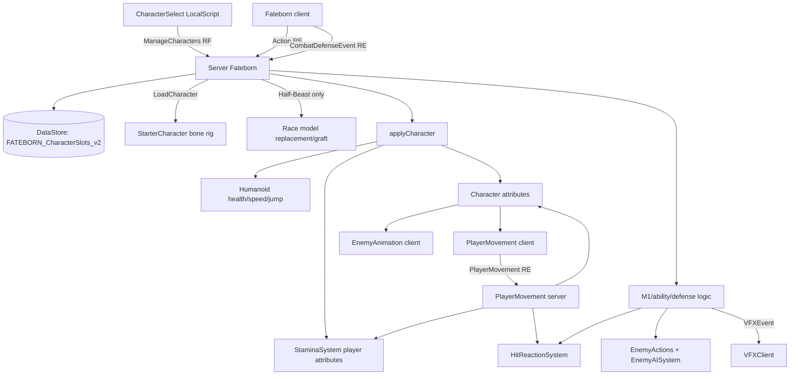
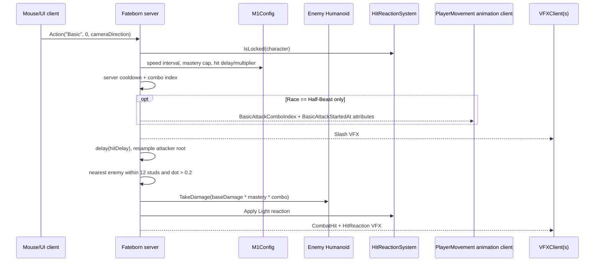
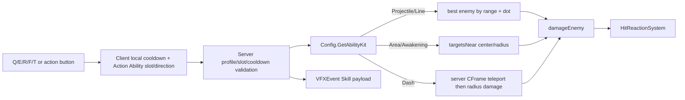
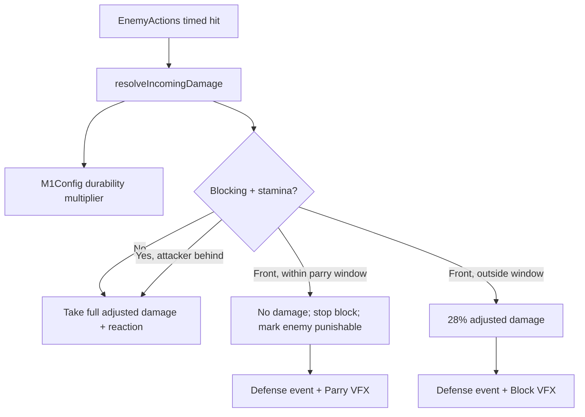

# FATEBORN V2 M0 Legacy Audit & Migration Map

Audit date: 2026-09-11

Tracking issue: `#1 [V2 M0] Legacy Audit & Migration Map`

Scope: audit only; no runtime code, instances, assets, names, or gameplay behavior were changed.

## 1. Executive summary

The current character stack is functional but highly centralized and has multiple overlapping contracts. `ServerScriptService/Fateborn.legacy.luau` owns character slots, persistence, spawning, character configuration, race assignment, abilities, M1 combat, defense, enemy spawning, enemy combat, rewards, and part of VFX dispatch. Movement and stamina are split across a second server script and three modules. Player animation, locomotion physics, sprint/roll/jump input, and procedural bone posing are concentrated in `StarterPlayer/StarterPlayerScripts/PlayerMovement.local.luau`.

The server is authoritative for accepted M1s, ability cooldowns, target selection, enemy damage, incoming player damage, stamina, rolls, block/parry outcomes, hit reactions, death, and respawn. Clients choose semantic actions and aim direction, display local cooldowns/UI, and render animation/VFX. Important gaps remain in server validation: the dormant-but-callable `Action` sprint/dash paths bypass the authoritative stamina/ground/reaction rules, repeated `Block=true` packets can continually reopen the perfect-parry window, and abilities do not perform collision/line-of-sight checks.

Race data has three incompatible sources:

1. `ReplicatedStorage/Shared/Config.luau` is the active Fate/race roll and ability source.
2. Two copies of `ZeroScript/Data/RaceData.luau` feed a disabled legacy spin path.
3. `ReplicatedStorage/Combat/M1Config.luau` has a different race roster and fallback behavior.

Only Half-Beast has a registered custom model/animation package. Every other race currently keeps the custom bone-based `StarterCharacter` and uses the generic bone animation fallback. Race passives are descriptive strings, not active mechanics. The active M1 calculation does not use most of the race M1 profile in `M1Config`.

Studio inspection found current dependencies not represented on disk: an active `HumanBoxingBones` LocalScript, an active but immediately-returning `HumanBoxingCombo` LocalScript, two empty active instances named `HalfBeastAnimationLoader`, the custom `StarterCharacter`, imported character/enemy models, animation objects, and the particle source pack. This is the most important source-control risk before migration.

The audit supports starting V2 as a shadow/data-contract layer. Do not begin by replacing combat or movement. First establish canonical race, action, state, and stat contracts; then add adapters that read the current attributes/remotes while the legacy runtime stays authoritative.

## 2. Current architecture overview

### Runtime shape



### Architectural boundaries that actually exist

- Character persistence/lifecycle: `Fateborn.legacy.luau` plus `CharacterSelect.local.luau`.
- Character construction: Roblox `StarterCharacter` for the base bone rig; server-side grafting for Half-Beast.
- Player movement authority: client supplies normal locomotion direction through the Humanoid; the server controls sprint speed/stamina and roll impulse.
- Player animation authority: local clients. The local player gets cached native tracks; remote bone characters mostly receive procedural locomotion/reaction poses.
- Combat authority: server `Fateborn.legacy.luau`, with timing/stat helpers from `M1Config` and reaction logic from `HitReactionSystem`.
- Enemy authority: server `Fateborn.legacy.luau` plus `EnemyAISystem` and `EnemyActions`; client `EnemyAnimation` renders replicated attribute cues.
- Race identity authority: persisted server profile, copied to a Character `Race` attribute.
- Presentation: `Fateborn.local.luau`, `VFXClient.local.luau`, `StaminaClient.local.luau`, `TargetLock.local.luau`, and `GameplayMouse.local.luau`.

## 3. Script inventory

### Active synchronized runtime source

| Path | Side/type | Purpose and owned state | Called by / calls and references |
|---|---|---|---|
| `ServerScriptService/Fateborn.legacy.luau` | Server Script | Main bootstrap; sets `CharacterAutoLoads=false`; owns accounts, active profiles/slots, combat cooldowns/combo state, defense state, enemy table, respawn queue, boosts, world enemy population, rewards, persistence, character application and race replacement | Roblox player/marketplace lifecycle and all `FatebornRemotes`; requires `Config`, `M1Config`, `RaceCharacterModels`, `HitReactionSystem`, `EnemyAISystem`, `StaminaSystem`, `EnemyMotion`, `EnemyActions`, and `EnemyRig`; references DataStore `FATEBORN_CharacterSlots_v2`, ServerStorage race/VFX/enemy templates, animation/race attributes, and VFX remotes |
| `ServerScriptService/PlayerMovement.legacy.luau` | Server Script | Authoritative sprint drain/speed and roll validation/impulse; owns per-player last-roll timestamps | Receives `ReplicatedStorage.PlayerMovement`; requires `StaminaSystem` and `HitReactionSystem`; emits `VFX.VFXEvent`; writes `Sprinting` and `RollStartedAt`; creates temporary `Attachment`/`LinearVelocity` |
| `ServerStorage/ZeroScript/StaminaSystem.luau` | Server ModuleScript | Server stamina resource; owns weakly external `states[player]`, drain sources, regen delay, and an internal depleted signal | Required by both server runtime scripts and `HitReactionSystem`; reads/writes Player `Stamina`/`MaxStamina`; listens to Players/CharacterAdded/Heartbeat |
| `ServerStorage/ZeroScript/HitReactionSystem.luau` | Server ModuleScript | Flinch/stagger/finisher lock, heavy-pressure accumulation, knockback and sprint interruption | Called by player movement and combat; calls `StaminaSystem`; writes hit-reaction attributes and enemy action timing fields |
| `ServerStorage/ZeroScript/EnemyAISystem.luau` | Server ModuleScript | Enemy target selection, patrol/aggro/chase/attack/retreat/stagger/death state machine; owns AI state inside each enemy data record | Attached/stepped by main server Heartbeat; reads Players/Humanoids and reaction attributes; writes `AIState`, `AITier`, `AnimationRunning` |
| `ServerScriptService/EnemyActions.luau` | Server ModuleScript | Enemy action timing, hit callbacks, animation cues, and death cue | Called by main server; requires `EnemyMotion`; writes `AnimationAction`, timestamps/sequence and `AnimationHitAt`; owns `ActionToken`/`ActionEnd` fields in enemy data |
| `ServerScriptService/EnemyRig.luau` | Server ModuleScript | Builds fallback procedural enemy body/Motor6D rig | Called by main server only when no `WandererAsset` visual motor exists; creates parts/joints; tags `FatebornAnimatedEnemy` |
| `ReplicatedStorage/Shared/EnemyMotion.luau` | Shared ModuleScript | Enemy action clip keyframes, hit timings, gait sampling, movement profiles | Required by server main/`EnemyActions` and client `EnemyAnimation`; no remotes; data-only plus sampling functions |
| `ReplicatedStorage/Shared/Config.luau` | Shared ModuleScript | Active rarity/race/Fate pools, stat tiers, unlocks, ability kits, enemy stats, monetization | Required by server and `Fateborn.local`; active source for Fate rolls and skill data; race passives are presentation-only strings |
| `ReplicatedStorage/Combat/M1Config.luau` | Shared ModuleScript | Race M1 profiles, combo curves, stat normalization, damage/timing helper functions | Required only by main server; live path uses speed interval/hit delay, mastery cap/damage multiplier, and durability multiplier. Reach, width, cleave, race tempo/damage and `GetDamage` are not used by the live M1 handler |
| `ReplicatedStorage/ZeroScript/Data/RaceCharacterModels.luau` | Shared ModuleScript | Registry for custom race model and animation overrides; currently Half-Beast only | Required by server character replacement and client player animation; points to `ServerStorage.PlayerAssetSources.HalfBeastCharacter.Char half beast` and 16 animation IDs |
| `ReplicatedStorage/VFX/Assets.luau` | Shared ModuleScript | Logical VFX template names and source asset metadata | Required by `VFXClient`; logical paths often need client alias translation to match imported names |
| `ReplicatedStorage/VFX/Presets.luau` | Shared ModuleScript | Presentation defaults for effect colors/radius/lifetime/density | Required by `VFXClient`; several aliases (`CombatHit`/`HitLight`, `HeavyHit`/`HitHeavy`) intentionally overlap |
| `ReplicatedStorage/VFX/MigrationManifest.luau` | Shared ModuleScript/data | Historical VFX import counts, active mapping record and validation claims | Not required by current runtime; documentation/data for asset migration |
| `StarterPlayer/StarterPlayerScripts/Fateborn.local.luau` | Client LocalScript | Main UI, intro/wheels, action bar, input for M1/skills/block, target-based aim, client cooldown display, announcements and defense indicators; owns `currentState`, local cooldowns and menu flags | Invokes/listens to `FatebornRemotes` and `CombatDefenseEvent`; requires `Config`; creates BGM and most gameplay UI |
| `StarterPlayer/StarterPlayerScripts/CharacterSelect.local.luau` | Client LocalScript | Three-slot selection/create/delete UI and initial entry flow | Invokes `ManageCharacters`; creates/fires `ReopenCharacterSelect` and `CharacterSelectClosed` BindableEvents in PlayerScripts |
| `StarterPlayer/StarterPlayerScripts/PlayerMovement.local.luau` | Client LocalScript | Active sprint/roll/jump input, local bone-character physics, rotation, cached local animation tracks, locomotion/action arbitration, and procedural fallback posing; owns `rigs`, local sprint and animation action windows | Sends `PlayerMovement` remote; requires `RaceCharacterModels`; reads server character attributes and Humanoid state; disables character `Animate`; writes local diagnostic animation attributes |
| `StarterPlayer/StarterPlayerScripts/TargetLock.local.luau` | Client LocalScript | Hold-RMB target acquisition/switching, camera/character facing, target indicator | Scans `Enemy=true` models; owns local `TargetLockTarget` ObjectValue and `CombatFacingLock`; consumed by `Fateborn.local` aim and `PlayerMovement` rotation |
| `StarterPlayer/StarterPlayerScripts/VFXClient.local.luau` | Client LocalScript | Resolves imported particle templates, clones emitters, renders bursts/loops and cleans transient anchors | Receives `VFXEvent` and local `VFXLocal`; requires `Assets`/`Presets`; waits for runtime-created `VFX.Templates`; creates `Workspace.ClientVFX` |
| `StarterPlayer/StarterPlayerScripts/EnemyAnimation.local.luau` | Client LocalScript | Procedural animation for tagged enemies, action clips, gait, hit reaction and death | Requires `EnemyMotion`; scans `FatebornAnimatedEnemy`; reads replicated AI/action/reaction attributes and writes Bone/Motor6D transforms |
| `StarterPlayer/StarterPlayerScripts/GameplayMouse.local.luau` | Client LocalScript | Menu/gameplay mouse ownership and gameplay UI visibility | Observes generated GUI names; writes Player `GameplayActive`; Stamina HUD and Lantern input consume it |
| `StarterGui/StaminaHUD/StaminaClient.local.luau` | Client LocalScript | Curved world-tracked stamina display | Reads Player stamina attributes and `GameplayActive`; tracks current Character root each render frame |
| `StarterPlayer/StarterCharacterScripts/Animate.local.luau` | Client LocalScript | One-line no-op marker saying animation belongs to `PlayerMovement` | Cloned into character; has no executable behavior |
| `StarterPack/Lantern/LanternEquip.legacy.luau` | Server Script cloned with the Tool under Legacy RunContext | Character-attached lantern orb/trails and server Heartbeat follow animation | Uses `LanternOrbAsset` and `LanternTrailCurveAsset`; creates/destroys replicated temporary character visual instances; no network contract |
| `StarterPlayer/StarterPlayerScripts/LanternHotbar.local.luau` | Client LocalScript | Replaces Backpack display/input for Lantern | Reads `GameplayActive`, equips/unequips the Tool, references image `114673441710459` |

### Present but inactive, superseded, empty, or legacy

| Path | Current status in Studio | Audit finding |
|---|---|---|
| `StarterPlayer/StarterPlayerScripts/MovementController.local.luau` | Disabled | Older R15 sprint/dash/landing VFX controller using `Action` and `VFXLocal`. Would overlap active Shift/Ctrl and animation ownership if enabled. |
| `StarterPlayer/StarterPlayerScripts/MovementControllerV2.local.luau` | Disabled | Another R15 walk/run/roll controller using `Action`. Would create client-owned sprint/dash state and overlaps the active movement stack. |
| `StarterPlayer/StarterCharacterScripts/MovementAnimations.local.luau` | Disabled | Attribute-driven generic dash/roll animation. Superseded by `PlayerMovement`. |
| `StarterPlayer/StarterCharacterScripts/RollAnimation.local.luau` | Disabled | P-key visual-only roll with no server movement/validation. Superseded. |
| `StarterPlayer/StarterPlayerScripts/HalfBeastAnimationLoader.local.luau` | Two enabled Studio instances; synchronized file is zero bytes | Both instances are empty and execute no behavior. Duplicate/dead candidates, but not removed. |
| `StarterPlayer/StarterPlayerScripts/StudioDebugBypass.local.luau` | Disabled; one-line comment | No active bypass. The `Memory` module description claiming an active bypass is stale. |
| `ServerScriptService/RaceSpinHandler.legacy.luau` | Disabled | Old race-only roll through `SpinRaceEvent` and Player attributes; conflicts with active profile/Fate flow if enabled. |
| `ServerStorage/ZeroScript/SpinSystem.luau` | Module, required only by disabled race handler | Legacy weighted direct race roll and Player-attribute assignment. |
| `ReplicatedStorage/ZeroScript/Data/RaceData.luau` | Module, required only by disabled Studio `WheelLocalScript` | Client copy of legacy race list. |
| `ServerStorage/ZeroScript/Data/RaceData.luau` | Module, required only by `SpinSystem` | Duplicate server copy of legacy race list. |
| `StarterGui/WheelUI/WheelLocalScript` | Studio-only, disabled | Old race reel UI; uses `SpinRaceEvent` and replicated legacy `RaceData`. Not represented on disk. |
| `ServerStorage/WandererAnimScript.legacy.luau` | Enabled property, but under ServerStorage and never cloned by current code | Legacy direct-CFrame bounce animation; does not run in its current location and is superseded by `EnemyAnimation`. |
| `ReplicatedStorage/AnimationSources/R15 Walk Anim/ReadMe.legacy.luau` | Enabled property under ReplicatedStorage | Three-line import readme Script; does not run in ReplicatedStorage and has no runtime responsibility. |

### Live Studio-only code dependencies

These are authoritative live instances but are not synchronized files:

| Studio path | Status | Responsibility / issue |
|---|---|---|
| `StarterPlayer.StarterPlayerScripts.HumanBoxingBones` | Enabled, 457 lines | Procedural Human bone M1 poses and three combat sounds; listens to `BasicAttackStartedAt`/`BasicAttackComboIndex` and writes Bone transforms on `RenderStepped`. Main server currently emits those attributes only for Half-Beast, so this active script receives no accepted Human M1 cue. |
| `StarterPlayer.StarterPlayerScripts.HumanBoxingCombo` | Enabled, 228 lines | Standard Motor6D Human boxing implementation, but line 14 is `do return end`; runtime inert. |
| `StarterPlayer.StarterPlayerScripts.HalfBeastAnimationLoader` (two instances) | Enabled, zero-byte source | No behavior; duplicate names/instances. |
| `StarterGui.WheelUI.WheelLocalScript` | Disabled, 191 lines | Legacy race spin UI described above. |

### Archived/reference source (not runtime)

- `ServerStorage/AnimationBackups/FatebornBeforeFullAnimation.legacy.luau`
- `ServerStorage/PlayerMovementBackup_20260906/*` (six LocalScripts)

These were inspected only as archive locations/classification boundaries. They must not be treated as current source or migrated automatically.

### Reviewed and excluded from the character migration runtime

`DayNightCycle.legacy.luau`, `OldShackDoor` (Studio-only), `RojoServerTest.server.luau`, `Shared/RojoTest.luau`, and the environment asset-library light script do not currently call character, race, combat, animation, state, or network systems. Day/night has no current Vampire/Undead/passive integration.

## 4. Client/server responsibility map

| Concern | Client today | Server today | Authority |
|---|---|---|---|
| Character slot choice | Renders UI; requests create/delete/select | Validates slot/action, mutates account/profile, saves and calls `LoadCharacter` | Server |
| Normal movement | Roblox controls produce `Humanoid.MoveDirection`; active client directly sets horizontal root velocity and rotation for bone characters | Replicated Humanoid/physics; no independent speed-position validation | Mixed; client network ownership controls ordinary locomotion |
| Sprint | Captures Shift and requests boolean | Validates alive/reaction/stamina, sets WalkSpeed and stamina drain | Server for active `PlayerMovement` path |
| Jump | Active client validates local Humanoid state, forces Jump/ChangeState and Y velocity | Server only supplies JumpPower/stat configuration | Client/engine; not server validated |
| Roll | Captures Ctrl and requests roll; renders clip/whole-mesh rotation | Checks alive, reaction, grounded, cooldown and stamina; applies impulse/timestamp | Server acceptance and impulse |
| M1 | Captures mouse/button, sends aim direction; no prediction | Accepts cooldown, combo, target cone/radius, timing and damage | Server |
| Skills | Sends slot/direction and immediately starts UI cooldown | Validates slot/profile/server cooldown; moves/targets/damages | Server outcome; client aim input |
| Block/parry | Sends held V; renders indicators | Owns block timestamp, stamina drain, facing test, parry and mitigation | Server, with packet-reset exploit noted below |
| Hit reaction | Renders replicated attributes | Owns pressure, duration, locks and knockback | Server |
| Target lock | Selects target, camera and local facing; supplies resulting aim direction | Does not validate the selected object itself; validates world target search/ranges for attacks | Client targeting aid only |
| Animation | Loads/plays local tracks and writes procedural transforms | Emits a few timestamps/attributes; creates Animator | Client presentation |
| VFX | Resolves templates and renders effects | Chooses effect/payload and broadcasts | Server-triggered, client-rendered |
| Health/death/respawn | Displays/render death | Humanoid damage, Died handlers and delayed respawn | Server/engine |

## 5. Dependency graph and call flows

### Character lifecycle

```mermaid
sequenceDiagram
    participant C as CharacterSelect client
    participant F as Fateborn server
    participant D as DataStore
    participant R as RaceCharacterModels
    participant P as PlayerMovement client

    F->>F: Players.CharacterAutoLoads = false
    F->>D: GetAsync account slots
    C->>F: ManageCharacters(List/Create/Select, slot)
    F->>F: set activeSlots/profiles + save
    F->>F: Player:LoadCharacter()
    F->>R: getProfile(profile.Fate.Race.Name)
    alt Half-Beast profile exists
        F->>F: clone current character, graft template mesh/bones, set Player.Character
    end
    F->>F: applyCharacter stats/attributes/aura/billboard
    F-->>C: State/ManageCharacters result
    P->>P: register bone character; disable Animate; cache local tracks
    F->>F: Humanoid.Died -> 3s -> LoadCharacter
```

### M1 flow



Important: the live M1 path is not a box hitbox. It scans the server `enemies` table inside a 12-stud sphere, applies a forward dot threshold, and picks one nearest target. `M1Config.HitboxHeight`, race reach/width/cleave, target half-angles, and `AllowPvP` are not consulted.

### Ability flow



### Incoming enemy damage / defense



## 6. Network / event inventory

All locations are under `ReplicatedStorage` unless noted. `FatebornRemotes`, `PlayerMovement`, `VFXEvent`, `VFXLocal`, and `VFX.Templates` are created by server Scripts at runtime; they are absent in Edit mode before play.

| Name/location/type | Direction and participants | Payload / purpose | Validation and status |
|---|---|---|---|
| `FatebornRemotes.RequestState` RemoteFunction | Client -> server | No args; returns public active profile | Handler exists, but current client binds it and never invokes it. Suspected obsolete. |
| `FatebornRemotes.AwakenFate` RemoteFunction | Client -> server | `category: string`; returns `{Ok, Result, State}` | Validates profile, category, unlock, and unassigned state; server rolls. Active. |
| `FatebornRemotes.RerollFate` RemoteFunction | Client -> server | `category: string`; returns result/state/cost | Validates profile/category/unlock/existing Fate/ticket count. Active. |
| `FatebornRemotes.InspectPlayer` RemoteFunction | Client -> server | `userId: number`; returns public online profile | Type-checks ID and requires online profile. No distance check; disclosure is intentionally broad/public. |
| `FatebornRemotes.ManageCharacters` RemoteFunction | Client -> server | `action: List/Create/Delete/Select`, `slot` | Per-player account, action and slot validation. Delete has no server-side confirmation token; client performs two-click confirmation. Active. |
| `FatebornRemotes.Action` RemoteEvent | Client -> server | `(action, value, direction)`; Basic, Ability, Sprint, Dash, IntroSeen | Basic/Ability validate reaction and server cooldown. Sprint/Dash handlers remain callable even though active clients use another remote; they omit stamina and some state checks. High-risk duplicate contract. |
| `FatebornRemotes.State` RemoteEvent | Server -> one client | `(publicState, notice?)` | Server-produced only. Active UI/profile replication. |
| `FatebornRemotes.Announcement` RemoteEvent | Server -> one/all clients | `(text, kind)` | Server-produced only. Active notification channel. |
| `CombatDefenseEvent` RemoteEvent | Client <-> server | C->S `("Block", boolean)`; Studio-only `("DebugHit", damage)`; S->C `(Parry/Block/Punish/GuardBreak, position, extra?)` | Alive/stamina check on block start. Repeated true resets `BlockStarted`, so a hostile client can refresh the parry window. DebugHit is guarded by `RunService:IsStudio()`. Active. |
| `PlayerMovement` RemoteEvent | Client -> server | `("Sprint", boolean)` or `("Roll")` | Active authoritative movement path. Sprint checks type/alive/reaction/stamina; roll checks alive/reaction/ground/cooldown/stamina and derives direction server-side. |
| `VFX.VFXEvent` RemoteEvent | Server -> all clients | `(effectName, position, color?, data?)` | Internal server senders; client validates position type, then renders. Active. |
| `VFX.VFXLocal` BindableEvent | Same client VM | Same shape as VFX event | Listener active in `VFXClient`; only disabled `MovementController` currently fires it. Runtime-created by server and replicated as an instance. Dormant. |
| `SpinRaceEvent` RemoteEvent | Client <-> server | C->S no payload; S->C legacy race result | Both handler and Wheel client are disabled. Duplicate obsolete race contract. |
| `PlayerScripts.ReopenCharacterSelect` BindableEvent | Client internal | No payload | Created by `CharacterSelect`; fired by `Fateborn` home button. Active. |
| `PlayerScripts.CharacterSelectClosed` BindableEvent | Client internal | `selectedState?` | Created by `CharacterSelect` or defensively by `Fateborn`; carries selected profile state. Active, with duplicate-creator race handled by lookup. |
| `StaminaSystem.Depleted` unparented BindableEvent signal | Server internal | `(player)` | Fired at zero stamina; consumed by movement and defense to stop sprint/block. Active. |

No relevant Remote/BindableFunctions other than those listed were found.

## 7. Character state ownership map

| State | Representation today | Primary writer/owner | Consumers and conflicts |
|---|---|---|---|
| Idle | Derived locally from horizontal speed <= 0.7 and grounded state; native `Idle` track when available, otherwise procedural pose | `PlayerMovement` client | No server state. Half-Beast native; generic bone races procedural. |
| Walk | Root horizontal speed + Humanoid state; `Walk` track/procedural phase | `PlayerMovement` client; server sets base WalkSpeed | Active client directly overwrites horizontal root velocity. |
| Run/sprint | Client `sprint` boolean; Character `Sprinting`; Humanoid WalkSpeed; stamina drain source | Client requests; `PlayerMovement` server owns accepted state | Duplicate dormant `Action("Sprint")` path can set speed without stamina drain. |
| Jump | Humanoid `Jump`, `Jumping` state, FloorMaterial, local `jumpStartedAt`, `jumpCommandedAt`, selected `Jump`/`RunningJump` track | `PlayerMovement` client + engine | No server action/state validation; explicit CAS + `JumpRequest` paths are debounced. |
| Fall | Humanoid `Freefall` or air FloorMaterial, Y velocity | Engine/client animation resolver | No explicit replicated state. |
| Climb | Humanoid `Climbing` | Engine/client animation resolver | No server state. |
| Swim | Humanoid `Swimming`, speed selects Swim/SwimIdle | Engine/client animation resolver | No server state. |
| M1 | `basicComboStates[player]`, `cooldowns[player].Basic`; Half-Beast-only `BasicAttackComboIndex` and `BasicAttackStartedAt`; local `actionName/actionUntil`/track | Main server accepts/damages; local player renders | Server attributes omit Human/all other races. Remote observers do not load local native action tracks. Studio Human boxing listener is therefore currently uncued. |
| Roll | Server `lastRoll[player]`; Character `RollStartedAt`; temporary `LinearVelocity`; local derived roll window/track/visual Motor6D | Movement server accepts/impulses; movement client renders | Client and server both use 0.6 seconds. Client also rotates whole visual while playing a roll clip, risking compounded rotation. |
| Block | `defenseStates[player].Blocking/BlockStarted`; Character `Blocking`; stamina drain source | Main server | Local player animation consumes attribute; no explicit remote-character block animation path. |
| Parry | Derived event when incoming hit occurs within `BlockStarted` window; enemy `PunishableByUserId`, `PunishUntil`, `AdvancedCounter` | Main server | No Player parry state attribute; client gets one feedback event. Block packet replay can refresh the window. |
| Skill casting | `cooldowns[player][SkillN]`; Half-Beast-only `SkillCastStartedAt`; local cooldown table and animation action window | Main server outcome; client UI | No casting/interrupt state, no stamina/mana state, and no cast duration gate. |
| Flinch/stagger/finisher | Character/enemy `HitReaction`, `HitReactionStartedAt`, `HitReactionUntil`, `Staggered`; module weak tables for token/pressure | `HitReactionSystem` server | Movement/AI/actions/animation consume it. Enemy `AnimationHitAt` duplicates a generic hit cue. |
| Death | Humanoid Health/Died; local `rig.dead`; enemy `AIState=Death`/`AnimationAction=Death`; player `respawnQueued` | Engine + main server | Player local Death track only exists for registered profile with asset; remote players fall back to procedural pose. |

### Duplicated/conflicting ownership

- `Sprinting`/WalkSpeed can be written by the active movement server, main server `Action` handler, disabled movement clients, and hit reaction cleanup.
- `Dashing` belongs only to disabled clients; the active roll uses `RollStartedAt`. The two terms describe overlapping historical implementations.
- M1 combo/cooldown authority is server tables, but action presentation is a Half-Beast-only attribute contract plus uncued Studio-only Human scripts.
- Animation state exists simultaneously as Humanoid state, track state, local action timestamps, server timestamps, and client-only `LocalAnimationState`/`LocalAnimationSource` diagnostics.
- `AnimationHitAt` is written both by `HitReactionSystem` and health-change observation in `EnemyActions`.
- Race identity exists in persisted `profile.Fate.Race`, Character `Race`, custom-only `RaceCharacterProfile`, legacy Player `Race`, and M1 fallback attribute names.

## 8. Animation architecture audit

### Storage and loading

- Half-Beast animation IDs and tuning are centralized in `RaceCharacterModels.luau`.
- Generic bone fallback IDs (`Walk`, `Run`, `Roll`) are hardcoded inside `PlayerMovement.local.luau`.
- Disabled R15 controllers reference Studio `R15Anims`; `HaynobiAnims`, `BaseRollCharacter`, and its keyframe sequence are not part of the active path.
- Player `Animator` is created/ensured server-side. The local player preloads one `AnimationTrack` per non-unclassified profile entry and caches it in `rig.tracks`.
- Other players are registered for procedural posing, but this controller loads/caches native tracks only when `character == LocalPlayer.Character`. Owner-started Action-priority tracks can still replicate through the server-created Animator; observer behavior therefore relies on implicit Animator replication rather than an explicit observer-side cue/cache.
- The Roblox `Animate` LocalScript is deliberately a no-op and is disabled again by `PlayerMovement` for registered characters.

### Priority and arbitration

Configured priorities are:

- Idle: `Idle`
- Walk/Run/Jump/RunningJump/Fall/Climb/Swim: `Movement`
- Block/Guard/Drink: `Action`
- M1/Roll/Backstep/SpellCast: `Action2`
- stumble reactions: `Action3`
- Death: `Action4`

`PreAnimation` chooses one state in this order:

`Death > hit reaction > roll > current timed action > block > swim/climb/jump/fall/run/walk/idle`

`playState` stops every other cached track before starting the selected track. Locomotion playback speed is adjusted from root speed. M1 and roll tracks are restarted at time zero; Half-Beast M1 then jumps to a 0.15-second source offset and runs at 1.4x. Roll speed is stretched to the remaining authoritative roll window.

### Procedural fallback

`PreSimulation` controls all registered bone rigs. If no recognized native/action track has meaningful weight, it generates bone poses for death, reactions, roll, air, walk/run, and idle. It also directly sets local-player horizontal root velocity and rotation. A separate active Studio-only `HumanBoxingBones` writes some of the same Bone transforms later on `RenderStepped` when its cue attributes change.

### Race-specific behavior

- Half-Beast: custom grafted mesh/bones, full native locomotion/action set, idle arm correction, M1 source offset/speed tuning, roll track plus full-mesh roll transform.
- Human: generic `StarterCharacter` bone rig and fallback locomotion. Studio `HumanBoxingBones` exists but the server does not emit its expected M1 attributes for Human.
- All other races: same generic StarterCharacter and fallback animation set. No distinct animation package.

### Causes of the reported/anticipated symptoms

#### M1 responsiveness delay

The client does not predict an attack animation. It sends `Action("Basic")`, waits for server acceptance, then Half-Beast receives a replicated `BasicAttackStartedAt` attribute and starts its track. Input-to-pose therefore includes a full client/server/replication round trip. Server `hitDelay` begins at acceptance, not at local animation onset. The 0.15-second track offset masks the source wind-up but does not remove network delay.

#### Stance before punch

Every Half-Beast combo slot selects the same `BasicAttack` clip. A start offset of 0.15 seconds explicitly skips an unwanted source stance; asset timing changes can reintroduce it. For other races there is no active server cue, so their presentation can remain in locomotion/idle instead of showing a punch.

#### Incorrect roll behavior

Half-Beast plays the `Roll_Dodge` animation and simultaneously rotates `RaceVisualRootWeld.Transform` through a full 360 degrees. If the clip already contains body rotation, the two rotations compound. A fallback procedural roll also exists, and part of that fallback hardcodes `0.6` rather than using the profile duration. The current tuning equals 0.6, but the contracts can drift.

#### Jump inconsistency from Idle/Walk

The current controller includes a targeted workaround: it binds Space/ButtonA at priority 5001, also listens to `JumpRequest`, debounces both, explicitly sets `Humanoid.Jump`, forces `Jumping`, and raises Y velocity. Risks remain because the decision is entirely local, depends on FloorMaterial/Humanoid state at the input frame, and is rejected during roll/reaction. The code comment says Half-Beast, but all current base characters have `FatebornBoneCharacter=true`, so this controller owns jump for every current race model.

#### Tracks fighting / duplicate ownership

- Active `PlayerMovement` and active Studio-only `HumanBoxingBones` can write the same Human Bone transforms on different frame phases.
- Re-enabling any of three disabled movement/animation scripts would duplicate input, tracks, `Sprinting`, `Dashing`, and roll behavior.
- `playState` globally stops all cached tracks, so adding a new overlay/action without integrating its priority hierarchy will be interrupted.
- Remote player action tracks are not loaded by each observer. Action-priority playback may replicate from the owning client, but locomotion/action parity depends on implicit Animator replication and different procedural arbitration on observers.

## 9. Combat architecture audit

### M1 and combo

1. Client mouse/button calls `basicAttack()` and sends camera/lock direction.
2. Server rejects invalid/dead/profile-less/reaction-locked attackers and enforces `GetSpeedAttackInterval`.
3. Server advances `basicComboStates[player]` up to the mastery cap. Finisher index applies a reset lock.
4. Half-Beast alone receives animation cue attributes.
5. Server delays by `GetSpeedHitDelay`, resamples attacker position, scans active enemy models within 12 studs, filters by aim dot > 0.2, selects one closest target, and deals damage.
6. Damage is `baseDamage(profile) * masteryMultiplier * comboCurve`. `baseDamage` includes level, mastery, Strength and Ability power.
7. `damageEnemy` applies punish multipliers, Humanoid damage, VFX, hit reaction, attribution, reward/death flow.

There is no player PvP path and no physical overlap hitbox. Most race combat geometry/data in `M1Config` is currently unused.

### Skills and cooldowns

- Ability identity comes from `profile.Fate.Ability`; five generic move records live in `Config.Abilities`.
- Client cooldowns are presentation-only and start immediately after send.
- Server cooldowns are per player/key in `cooldowns` and authoritative.
- Projectile/Line chooses the best dot-scored enemy within range; Area/Awakening scans an enemy-radius; Dash teleports the root then applies radius damage.
- Skills have no stamina/mana cost, cast lock, block/roll mutual exclusion, line-of-sight check, obstruction/collision check, or server-side animation completion requirement.

### Block, parry and punish

- V starts/stops block through `CombatDefenseEvent`.
- Server drains stamina and writes `Blocking`.
- Incoming damage applies durability first. A hit from behind bypasses defense; front hits inside a mastery-scaled 0.16-0.30 second window parry; later front hits deal 28%.
- Parry marks the enemy punishable for 1.35 or 1.8 seconds. The next hit from that player consumes the marker for 1.5x/2x damage and stronger reaction.
- Repeated block-start packets reset `BlockStarted`; the server does not require a false transition before another true transition.

### Roll and stagger interaction

- Active roll rejects reaction lock, air state, cooldown and insufficient stamina.
- Reaction lock cancels sprint and zeroes WalkSpeed. Basic/Ability are rejected during reaction.
- Block, `Action` Dash/Sprint, and jump are not all governed by one shared action-state gate, leaving overlap rules inconsistent.

### Death and rewards

- Enemy death awards only `LastHitUserId`; no assist record exists.
- Enemy is frozen, visually cued, Debris-cleaned after three seconds, and recreated after per-spawn delay.
- Player death queues `LoadCharacter` after three seconds if the same active slot/character remains.

### Client-trusted or weakly validated areas

| Risk | Finding |
|---|---|
| Client aim direction | Server normalizes and uses client direction. Origin/ranges are server-derived, limiting spoofing, but no turn-rate/line-of-sight validation exists. |
| `Action` Sprint bypass | Any client can call the still-active handler; it sets 1.45x WalkSpeed without stamina drain and is not reaction-gated. |
| `Action` Dash bypass | Any client can call it every 2.2 seconds without stamina or grounded checks; reaction lock does not cover Dash. |
| Parry refresh | Repeated `Block=true` can keep resetting the perfect window. |
| Ability dash geometry | Server performs a direct CFrame displacement without obstruction checking. |
| Normal locomotion | Client directly sets horizontal assembly velocity for its network-owned character; there is no independent movement sanity check. |

## 10. Race architecture audit

### Identity and selection

The canonical active identity is `profiles[player].Fate.Race`, persisted per slot. It is rolled from `Config.Pools.Race`, returned in public state, and copied to the Character `Race` attribute. `RaceCharacterModels` selects a custom package by exact name. Only `"Half-Beast"` resolves.

The disabled legacy stack stores race on the Player as `Race`, `RaceTier`, and `RaceDescription`. No active system reads these Player attributes. `M1Config` accepts Character `Race`, `RaceName`, or `FateRace`, falling back to Human.

### Model loading

- Every spawn starts from Studio `StarterPlayer.StarterCharacter`, a custom R6-typed Humanoid host with a skinned `char1` mesh, 22 bones, `FatebornBoneCharacter=true`, and asset marker `125661800403596`.
- Half-Beast clones that character, hides/removes its visuals, grafts the template `char1` and root bones, builds `RaceVisualRoot`/Motor6D/WeldConstraint, replaces `Player.Character`, and sets profile/asset attributes.
- Other races keep the same base model; they have no model registry entry.

### Stats, abilities and passives

- Fate Strength, Speed, Durability, Stamina and FightingMastery powers become Character/Player attributes and Humanoid stats.
- Race `Power` affects the aggregate displayed `computePower`, but active M1/ability damage does not directly apply the race Power.
- `M1Config.Races` supplies race combat data, but the live M1 path bypasses its race damage/reach/tempo/cleave calculations.
- Race passives in `Config.Pools.Race` and both `RaceData` copies are strings only. No passive behavior implementation was found.
- Abilities are Fate Ability packages (Flame/Wind/etc.), not race abilities.

### Data divergence

- Active `Config.Pools.Race` and legacy `RaceData` list the same 35 displayed races but use different schemas and roll probability models.
- `M1Config.Races` has several names absent from active race data (`Seraph`, `Reaper`, `Lich`, `Valkyrie`, `Minotaur`, `Banshee`, `Centaur`, `Ancient`, `Archdemon`, `World Serpent`, `Voidwalker`) and omits active names including `Elementalborn`, `Sylph`, `Undead`, `Elder Dragon`, `Oni Lord`, `Wendigo`, `Fallen Seraph`, `Abyssal`, `Voidborne`, `Chronos`, and `World Eater`. Missing active names silently use Human M1 data when those helpers are called.
- Direct shared-system race branches exist for Half-Beast character replacement, JumpPower selection, M1 cue emission, skill cue emission, and client roll comments/tuning. Studio Human boxing scripts add another exact race branch.

## 11. Asset and reference inventory

### Active or actively resolved

| Asset/reference | Location/use | Classification |
|---|---|---|
| Custom base `StarterCharacter` | Studio `StarterPlayer.StarterCharacter`; mesh `99181985909807`, texture `82437143069238`, 22 bones | ACTIVE |
| Half-Beast package | `RaceCharacterModels` asset marker `92882444915511`; Studio template mesh `103600399999811`, ColorMap `91715053578496` | ACTIVE |
| Half-Beast animations | IDs: Idle `93023224155940`, Walk `102484303929030`, Run `97338530445639`, Jump `127530492522295`, RunningJump `79379413190496`, Fall `107115183736873`, Climb `82555659345174`, Swim `80726995435994`, SwimIdle `132696654245914`, Basic `102842280636366`, Block `110775730964659`, Guard `92635610215820`, Roll `88464862837504`, Backstep `117701329736302`, SpellCast `117062604126285`, stumble clips `114357526081831`/`98029398471017`, Drink `129082128797786`, Death `122434589194163` | ACTIVE where selected; Guard/Backstep/Drink have no current state trigger; classify those UNKNOWN/UNUSED TODAY |
| Generic bone animations | Hardcoded Walk `92954261547077`, Run `85618915186426`, Roll `137733801815535` | ACTIVE for non-profile bone characters |
| Human boxing sounds | Studio-only `HumanBoxingBones`: swing `9045207152`, hit `75638578888623`, finisher `78971025489858` | POSSIBLY UNUSED because server never emits Human cue attributes |
| Wanderer visual | Studio `ServerStorage.WandererAsset`; mesh `108453756869040`, ColorMap `117740924498179` | ACTIVE for Wanderer only |
| Procedural enemy rigs | `EnemyRig` generated parts/joints for enemies without `WandererAsset` | ACTIVE |
| VFX source pack | `ServerStorage.Particle effects`, source asset `15261348321`: 106 Parts, 70 Attachments, 235 ParticleEmitters across 11 categories | ACTIVE; cloned to `ReplicatedStorage.VFX.Templates` at server startup |
| VFX renderer aliases | `VFXClient.templateAliases` maps logical names to imported names | ACTIVE and required because many `Assets.Templates` paths do not directly match source names |
| Fate aura | Runtime `PointLight` and optional direct `ParticleEmitter` with Roblox sparkle texture | ACTIVE; separate from reusable VFX renderer |
| Race/character GUI art | Background `82170075804483`, frame `136794656902184`, disc `95438265737848`, pointer `132667932806178`; generic wheel images `128407033592838`, `82810457243514`, `102644525607628`, ring `137270030340951`, pointer `88358094786405` | ACTIVE in generated client UI |
| BGM | `122094086809578` | ACTIVE |
| Lantern assets | `LanternOrbAsset`, `LanternTrailCurveAsset`, hotbar image `114673441710459` | ACTIVE adjacent character equipment |

VFX source category counts observed in Edit mode:

| Category | Parts | Attachments | Emitters |
|---|---:|---:|---:|
| BlackHoles | 2 | 2 | 11 |
| Blood | 8 | 7 | 21 |
| Explosions | 4 | 4 | 17 |
| Fire | 11 | 4 | 24 |
| Hits | 10 | 6 | 23 |
| Lightning | 12 | 6 | 13 |
| Other | 28 | 26 | 69 |
| Portals | 7 | 7 | 19 |
| Slashes | 9 | 4 | 21 |
| Smoke | 7 | 0 | 6 |
| Water | 8 | 4 | 11 |

### Duplicate, unused, or unknown Studio assets

| Asset/reference | Finding | Classification |
|---|---|---|
| `R15Anims` and `HaynobiAnims` | Overlapping Walk/Run/Roll/Dash animation folders; only disabled controllers reference `R15Anims`; no active source references `HaynobiAnims` | POSSIBLY DUPLICATED / LEGACY |
| `BaseRollCharacter` + `BaseRollCharacter_KeyframeSequence` | Used only by disabled legacy P-key script / import source | REQUIRED ONLY BY LEGACY |
| `UnclassifiedClip0` `86915032860131` | Explicitly skipped by loader | UNKNOWN |
| `ServerStorage.PlayerAssetSources` other seven imported containers | No current code references their names/IDs | SUSPECTED UNUSED; preserve as source/reference |
| `ReplicatedStorage.VioletWardenVisual` | Mesh `135215715932025`, ColorMap `99763895406419`; no current code reference | SUSPECTED UNUSED |
| `WandererModel`, `WandererModel2`-`5`, `FallenKingAsset` | Current code references only `WandererAsset`; `WandererModel5` and `FallenKingAsset` share mesh `127017229157633`, with texture/maps on the latter | POSSIBLY DUPLICATED / SUSPECTED UNUSED |
| `ServerStorage.VFXPreviewArchive` | 56 Attachments and 55 emitters; no runtime reference | REQUIRED ONLY FOR PREVIEW/ARCHIVE or UNKNOWN |
| `ReplicatedStorage.LanternEquipModel` | No current code reference; current tool uses Orb/Trail assets | SUSPECTED LEGACY |
| `StarterPack.Torch` | Separate tool with particle assets; no synchronized code dependency found | UNKNOWN / adjacent, not migrated as character core |
| `HealthHUD` | Empty ScreenGui in synchronized mapping | POSSIBLY UNUSED; Humanoid health has no dedicated current client script |
| Legacy `WheelUI` / `RaceWheelGui` | Disabled/unused by current generated Fate UI | REQUIRED ONLY BY LEGACY |

No assets were deleted, renamed, moved, or modified.

## 12. Architectural risks

Ranked highest to lowest:

1. **Split source of truth between disk and Studio.** Active Human boxing code and critical model/VFX instances are Studio-only. A migration based only on Git will omit behavior; a Script Sync conflict could overwrite work.
2. **Duplicate callable movement network paths.** `FatebornRemotes.Action` exposes sprint/dash paths that bypass stamina/ground/reaction validation in the active `PlayerMovement` service.
3. **No unified action/state gate.** Roll, block, parry, M1, ability, jump, reaction and death use separate booleans/timestamps/tables, allowing undefined overlaps.
4. **Animation replication asymmetry.** Native action tracks load only for the local player. Half-Beast M1/skill/block/death presentation can differ between actor and observers; non-Half-Beast M1 cues are absent.
5. **Parry-window replay.** Repeated `Block=true` resets the perfect timing window.
6. **Race data divergence.** Three registries disagree on schema, probability and roster; M1 silently falls back to Human for many active races.
7. **Monolithic main server.** Persistence, lifecycle, stats, combat, abilities, enemy logic, rewards and world bootstrap share mutable tables and local functions, making extraction order sensitive.
8. **Combat config is not the combat implementation.** Most reach/width/cleave/race damage fields are unused; documentation or migration that assumes them would change gameplay unintentionally.
9. **Client-owned locomotion/jump physics.** Horizontal velocity and jump launch are directly set locally with no movement sanity layer.
10. **Roll has two visual rotations.** Track rotation plus whole-model Motor6D rotation can compound.
11. **VFX name indirection is fragile.** `Assets` logical paths and imported template names differ; the runtime depends on a second alias table and startup cloning.
12. **Lifecycle replacement is recursive/implicit.** Half-Beast replacement assigns `Player.Character`, destroys the original, and relies on the next CharacterAdded pass recognizing `RaceCharacterProfile`.

## 13. OLD -> V2 migration ownership matrix

The proposed boundaries need three explicit additions:

- Add **CharacterLifecycleService**: selection, `LoadCharacter`, replacement orchestration and respawn should not be hidden inside a factory. `CharacterFactory` should construct/assemble only.
- Add **ResourceService** (or a narrowly named `StaminaService`): stamina has independent server lifecycle, costs, drains and replication and does not fit safely inside `StatCalculator`.
- Keep **VFXService/VFXController** as presentation boundaries. VFX dispatch/rendering is a real shared dependency and should not be absorbed into combat.

Cooldown storage can initially remain private to `CombatService`/`AbilityService`; extract a generic CooldownService only if a second real consumer requires identical semantics.

| Current responsibility | Current owner | Planned V2 owner | Risk |
|---|---|---|---|
| Player/account load/save | Main `Fateborn` | Existing persistence boundary + CharacterLifecycleService adapter | High |
| Slot create/delete/select | Main `Fateborn` + CharacterSelect | CharacterLifecycleService | High |
| Character spawn/respawn orchestration | Main `Fateborn` | CharacterLifecycleService | High |
| Base/custom rig assembly | StarterCharacter + `replaceRaceCharacter` | CharacterFactory | High |
| Runtime character references/profile facade | Scattered `player.Character`/`profiles` lookups | CharacterContext | Medium |
| Semantic action state and mutual exclusion | Attributes + tables + Humanoid state | CharacterState | High |
| Physical input binding | Fateborn client + PlayerMovement + disabled controllers | InputController | High |
| Action validation/routing | Two server RemoteEvent handlers | ActionRouter | Critical |
| Race identity/data lookup | Config + RaceData copies + M1Config + Character attrs | RaceRegistry | Critical |
| Race model/package selection | RaceCharacterModels + server branch | RaceLoader | High |
| Character assembly from package | Server clone/graft logic | CharacterFactory | High |
| Character stat application | `applyCharacter`, `baseDamage`, M1Config | StatCalculator | High |
| Runtime stat modifiers | Ad hoc attributes (`M1*Multiplier`, `DamageTakenMultiplier`) | ModifierSystem | High |
| Race passives | Descriptive strings only | PassiveSystem | Medium initially; high once enabled |
| Race-specific mechanics | Half-Beast branches; none for most races | Optional package Behavior modules | Medium |
| Stamina max/regen/drain/spend | StaminaSystem | ResourceService/StaminaService | High |
| Jump detection/command | PlayerMovement client | InputController -> CharacterState/locomotion adapter | Medium |
| Walk/run physics and facing | PlayerMovement client | Character locomotion controller using CharacterContext/State | High |
| Roll request/validation/impulse | PlayerMovement client/server | ActionRouter + CharacterState + movement action handler | High |
| Locomotion animation selection | PlayerMovement PreAnimation | AnimationResolver | High |
| Track cache/play/stop/blend | PlayerMovement | AnimationController | High |
| Procedural bone posing | PlayerMovement + HumanBoxingBones | AnimationController rig adapter | High |
| Race animation data | RaceCharacterModels + hardcoded fallback | Race package animation data + AnimationResolver | High |
| M1 input | Fateborn client | InputController | Medium |
| M1 combo/cooldown/target/damage | Main `Fateborn` + M1Config | CombatService | Critical |
| Ability input | Fateborn client | InputController | Medium |
| Ability kit/cooldown/execution | Config + main `Fateborn` | AbilityService | High |
| Block/parry/punish | Main `Fateborn` | CombatService + CharacterState | Critical |
| Flinch/stagger/finisher | HitReactionSystem | StatusEffectSystem (combat applies effects) | High |
| Buff/debuff framework | Not present | StatusEffectSystem + ModifierSystem | Medium |
| Health/damage/death | Humanoid + main server | CombatService + CharacterLifecycleService for respawn | High |
| Enemy target/movement state | EnemyAISystem | Preserve as enemy AI subsystem; consume shared CharacterContext/State only where useful | Medium |
| Enemy attack scheduling | EnemyActions + main server | CombatService-facing enemy action adapter | High |
| Target lock | TargetLock client | Input/targeting controller; keep separate from server authority | Low |
| VFX dispatch | Main server + movement server | VFXService | Medium |
| VFX rendering/templates | VFXClient + Studio particle pack | VFXController + asset registry | Medium |
| HUD/profile replication | State/Announcement + Fateborn UI | Presentation/ViewModel layer; not CharacterState authority | Medium |

## 14. Legacy cleanup candidates

Nothing in this list is approved for deletion during M0.

| Candidate | Classification | Cutover condition |
|---|---|---|
| Main `Fateborn.legacy.luau` | Definitely required today | All extracted services, persistence, enemy/world bootstrap and remotes have parity and callers are switched |
| Active PlayerMovement client/server | Definitely required today | V2 input/state/locomotion/animation/roll/stamina paths pass parity tests |
| Config, M1Config, RaceCharacterModels | Shared by legacy and future V2 during migration | Canonical registries/stat rules are adopted and adapters removed |
| StaminaSystem, HitReactionSystem, EnemyAISystem, EnemyActions, EnemyMotion, EnemyRig | Definitely required today; likely reusable/adaptable | Explicit V2 interface migration complete |
| Fateborn UI, CharacterSelect, TargetLock, VFXClient, EnemyAnimation, HUD | Definitely required today | Presentation contracts move to V2 without behavior loss |
| MovementController + MovementControllerV2 | Required only by legacy / suspected duplicate | Confirm disabled in target place and preserve one reference until V2 locomotion ships |
| MovementAnimations + RollAnimation | Required only by legacy / suspected duplicate | Confirm no alternate place enables them |
| RaceSpinHandler + SpinSystem + two RaceData copies + WheelLocalScript/UI | Required only by legacy / suspected duplicate | Active character/Fate system is canonical and no external caller uses `SpinRaceEvent` |
| Duplicate empty HalfBeastAnimationLoader instances/file | Suspected dead/duplicate | Confirm no plugin or sync workflow uses instance presence as marker |
| HumanBoxingCombo | Suspected dead | Immediate return confirmed; preserve until Human animation design is migrated |
| HumanBoxingBones | Cannot remove; active Studio-only dependency, though currently uncued | Capture in source control and decide/fix cue contract during animation migration |
| WandererAnimScript | Suspected dead | Confirm no runtime cloning from Studio-only systems/plugins |
| Animation backups and PlayerMovement backups | Archive/reference; not runtime cleanup | Retention policy decision outside gameplay cutover |
| R15Anims/HaynobiAnims/BaseRoll assets | Suspected duplicate / legacy | Asset-reference scan after controllers are removed |
| Extra PlayerAssetSources/VioletWarden/Wanderer model variants/VFX preview archive | Cannot determine yet | Asset provenance, licensing/permissions, and intended reference retention documented |
| `RequestState` and `VFXLocal` | Suspected obsolete/dormant contracts | Telemetry/caller confirmation and client migration complete |
| `Action` Sprint/Dash variants | Suspected obsolete and security-sensitive duplicate | Remove/disable only after all clients use canonical ActionRouter contract |

## 15. Unknowns requiring investigation

1. Which Studio-only scripts/assets are intentionally excluded from Script Sync versus accidentally unsynchronized? `HumanBoxingBones` must be captured or explicitly retired before code migration.
2. Are all listed animation/audio/mesh assets owned by the experience/group and loadable for every client in production? Static IDs do not prove permissions or runtime track length.
3. Is the double Half-Beast roll rotation intentional for the source clip, or compensation for a non-rotating clip?
4. Which race roster is product-authoritative for M1 profiles? The active Fate roster and M1 roster disagree.
5. Should race Power affect combat, or only the displayed aggregate Power score? Current behavior is mostly the latter.
6. Are race passive descriptions promises for future behavior or intended current behavior? No implementations were found.
7. Should remote players see the same M1/skill/block/death clips as the acting player? Current presentation is asymmetric.
8. What are the intended mutual-exclusion rules among block, roll, jump, M1, skill cast and reactions?
9. Should M1 use the configured reach/width/cleave/race tempo, or preserve the current fixed 12-stud nearest-target scan?
10. Is the direct ability Dash teleport allowed to cross walls/voids, or should it use collision-aware movement?
11. Do any other Team Create places or external Studio plugins enable the disabled legacy controllers/remotes? The audit covered the connected FATEBORN place only.
12. Existing production slot payload/version distribution was not inspected; migration adapters need representative saved profiles before schema work.

## 16. Recommended migration ordering

1. **Capture and freeze contracts.** Put the Studio-only Human animation scripts under synchronization or explicitly archive them. Record canonical remote actions, payloads, attributes, race names and stat semantics as tests/data, without changing runtime.
2. **Create canonical data registries in shadow mode.** Introduce RaceRegistry and animation/stat catalogs that can validate against current `Config`, `M1Config`, and `RaceCharacterModels` but do not drive gameplay.
3. **Introduce CharacterContext and CharacterState adapters.** Read current profile/Humanoid/attributes and expose one query API; legacy remains the writer.
4. **Unify action routing at the boundary.** Route current remotes into one validation layer while preserving payloads. Close duplicate Sprint/Dash and parry-refresh holes before changing mechanics.
5. **Extract StatCalculator and ResourceService.** Reproduce current health, speed, stamina, M1 and ability formulas with characterization tests, including current quirks.
6. **Extract AnimationResolver/AnimationController.** First reproduce local/remote behavior, then intentionally fix prediction and observer parity as separate approved changes.
7. **Extract CombatService and AbilityService.** Preserve target/damage/cooldown behavior initially; geometry/mechanic changes should be separate milestones.
8. **Move hit reactions/modifiers/passives.** Adapt HitReactionSystem into StatusEffectSystem, then add ModifierSystem/PassiveSystem only after canonical race packages exist.
9. **Extract CharacterFactory/RaceLoader and finally CharacterLifecycleService.** Character replacement and respawn are late because they touch camera, Player.Character, scripts, UI and persistence.
10. **Cut over and clean up only after parity/rollback gates pass.** Remove legacy remotes/scripts/assets in a dedicated cleanup milestone.

### Recommended M1 starting point: exact folders/modules

Create these first as non-authoritative modules; do not switch runtime callers in the same change:

```text
ReplicatedStorage/
  FatebornV2/
    Shared/
      Contracts/
        ActionIds.luau
        CharacterStateKeys.luau
        CharacterAttributes.luau
      Character/
        CharacterContext.luau
        CharacterState.luau
      Race/
        RaceRegistry.luau
        RaceLoader.luau
        Definitions/
          Human.luau
          HalfBeast.luau
      Animation/
        AnimationCatalog.luau
        AnimationResolver.luau
      Stats/
        StatCalculator.luau
ServerScriptService/
  FatebornV2/
    Tests/
      LegacyContractCharacterization.server.luau
```

`ActionRouter`, `AnimationController`, `CombatService`, `AbilityService`, `ResourceService`, `StatusEffectSystem`, `ModifierSystem`, `PassiveSystem`, `CharacterFactory`, and `CharacterLifecycleService` should follow only after the characterization test locks current data and contracts. The initial Race definitions should mirror current facts: Human generic bone host and Half-Beast custom package. Do not scaffold 35 empty behavior modules.

## 17. M0 exit-criteria evaluation

| Criterion | Result | Evidence |
|---|---|---|
| Every relevant legacy runtime path has a known purpose | PASS | Active, disabled, archive, and Studio-only inventories above |
| Major client/server flows documented | PASS | Lifecycle, M1, ability, defense and movement maps |
| Character state ownership understood | PASS | State table and conflict list |
| Combat ownership understood | PASS | Server/client split and authoritative path audit |
| Animation ownership understood | PASS | Track/procedural/frame-phase and observer analysis |
| Race-specific dependencies identified | PASS | Registry/model/branch/data-divergence audit |
| Important remotes/functions documented | PASS | Full network/event inventory |
| Important assets/config sources mapped | PASS | Code IDs plus read-only Studio hierarchy/counts |
| Every significant legacy responsibility has a V2 destination | PASS | Migration ownership matrix |
| M1-invalidating unknowns identified | PASS | Unknowns section and ordered prerequisites |
| No legacy script or asset removed | PASS | Documentation-only repository change; no Studio writes |

## M0 STATUS

**PASS** for architecture planning. This is not a claim that current gameplay is bug-free or that production asset permissions are verified.

## BLOCKERS

No blocker to closing the audit. Before implementation work that edits animation or character construction, resolve the Studio-only source-control gap for `HumanBoxingBones` and decide the canonical race/M1 roster.

## HIGH-RISK MIGRATION AREAS

1. Character spawn/replacement/respawn plus persistence
2. ActionRouter consolidation and network validation
3. Animation ownership, prediction, and remote-observer parity
4. Race/stat registry consolidation
5. Combat target/damage parity
6. Shared state/status-effect ownership
7. Stamina/movement interaction
8. VFX template alias/runtime cloning contract

## FILES CHANGED

- `docs/migration/V2_M0_LEGACY_AUDIT.md` — added this audit and migration map.

No Luau source, Roblox instance, asset, configuration, or gameplay file was changed.

## TESTS

- Full local `rg --files` inventory and repository-wide searches for requires, remotes, bindables, attributes, race names, Humanoid state, animation loading, character lifecycle, and asset IDs.
- Read-only Roblox Studio Edit-mode inspection of script enabled states, unsynchronized script source, custom StarterCharacter attributes/properties, race/enemy model assets, remotes, animation objects, GUI roots, VFX source hierarchy, and asset counts/IDs.
- `rojo sourcemap default.project.json` and `rojo build default.project.json` both completed successfully; temporary outputs were removed after validation.
- No Play session was started and no runtime mutation/instrumentation was added; behavioral conclusions are static call-path findings unless explicitly described as Studio hierarchy observations.
